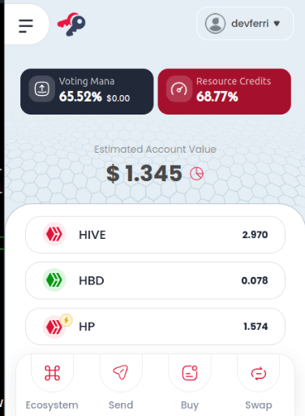

# Learn Hive Tokens

## Manage Hive

#### Manage Your Hive Tokens

You can easily manage your Hive tokens directly from your wallet. When you click on your wallet, you will see five key terms: **Hive**, **Hive Power**, **Hive Dollars**, **Savings**, and **Estimated Account Value**.

***

## 1. **Hive (HIVE)**

HIVE tokens are tradeable and can be transferred at any time. You can also convert HIVE into Hive Power through a process called **Powering Up**.

* **What is Powering Up?**
  * Powering Up is the process of converting HIVE tokens into Hive Power, which is essentially "staking" your tokens. This gives you increased influence and rewards within the Hive ecosystem.

***

## 2. **Hive Power (HP)**

Hive Power represents your stake in the Hive network. The more Hive Power you have, the more influence you have over the platform.

* **Benefits of Hive Power:**
  * **Voting Power:** More Hive Power gives you larger voting power on posts and proposals.
  * **Curation Rewards:** Increased rewards for curating content.
  * **More Resource Credits:** Additional resource credits to perform transactions on the Hive Blockchain.
  * **Hive Governance:** More say in supporting witnesses and projects on Hive.

To increase your Hive Power, you can **Power Up** your HIVE tokens.

***

## 3. **Hive Backed Dollars (HBD)**

HBD is a stablecoin pegged to the US Dollar. Each HBD token is generally worth about **$1.00 USD** in HIVE.

* **Note:** HBD can be converted into HIVE or used within the Hive ecosystem for transactions.

***

## 4. **Savings**

You can transfer your HIVE or HBD to **Savings** for added security. Tokens in savings are subject to a **3-day withdrawal waiting period**.

* **Why use Savings?**
  * Savings provides a safer way to store your tokens, while also offering a **20.00% APR** on your HBD, as defined by the network's witnesses.

***

## 5. **Estimated Account Value**

The **Estimated Account Value** gives you an approximate USD value of the tokens in your wallet based on their average market value. This helps you track the worth of your Hive assets in terms of real-world value.

***

By understanding these five key terms, you can effectively manage your Hive tokens and make the most of the features available on the Hive Blockchain.
