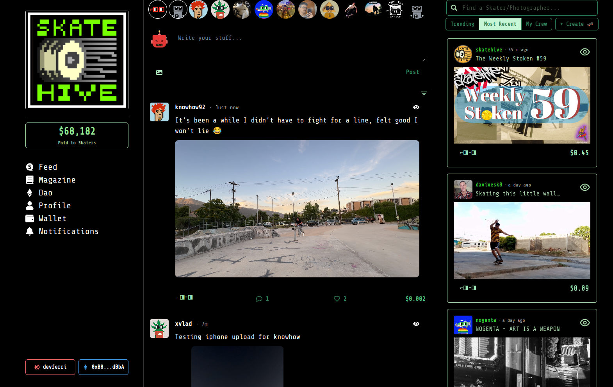

# How to Login

### How to Login to Skatehive.app

Follow these steps to log in to **Skatehive** using **Hive Keychain**.

---

### Step 1: Visit Skatehive

Go to [**Skatehive**](https://skatehive.app/) and import your Hive account.

---

### Step 2: Use Hive Keychain

Click on **"Login with Keychain"**.

> **Note:**
> If you don’t have Hive Keychain installed, [**Download Hive Keychain**](https://hive-keychain.com/) and click on **"Login"**.

---

### Step 3: Enter Your Hive Username

Type in your **Hive username** in the login prompt.

---

### Step 4: Confirm the Keychain Transaction

Approve the **Keychain message** to proceed.

---

### Step 5: Welcome to Skatehive!

You’re all set! Explore and enjoy **Skatehive**.

