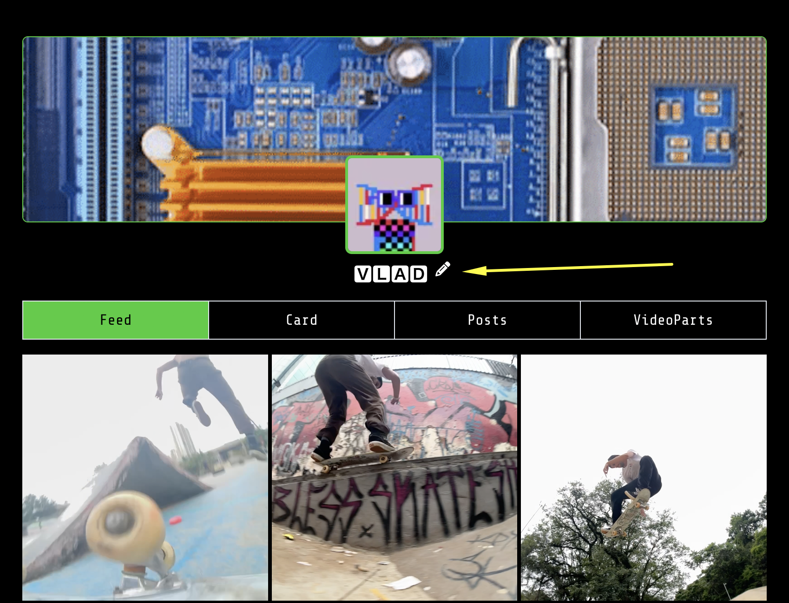
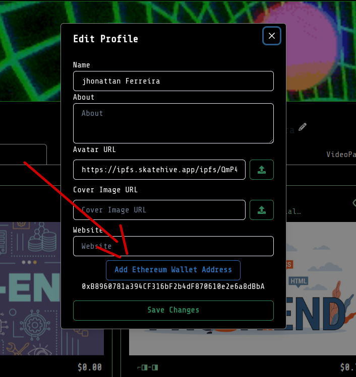
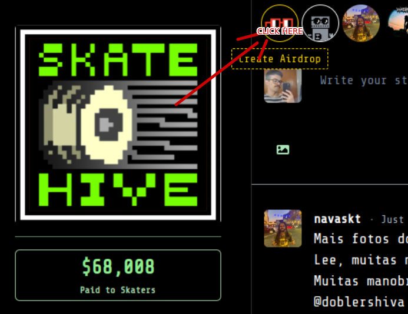
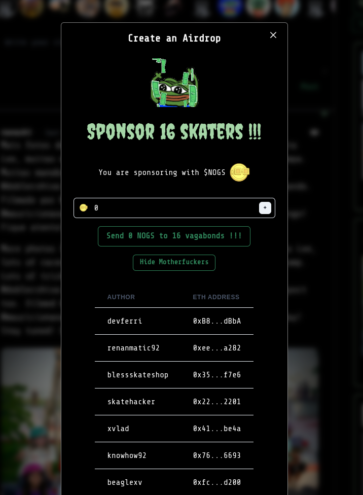

# Be eligible for airdrops

#### How to get lucky

1. Go to [**Webiste skatehive.app**](https://skatehive.app) and connect both your Hive and Ethereum wallets.
2. **Visit your profile page**.
3. **Click the "Edit Profile" button** (the pencil icon).

1. **Click the "Add Ethereum Wallet" blue button**.
2. 
3. **Start using Skatehive**: post, like, and comment on the Feed.
4. **Important**: You need to have an **Ethereum wallet registered** to receive the HIVE airdrops for now.

#### How to create an airdrop

7. On the homepage, **click the "Create Airdrop" button**.
8. **Wait for our Pepe God** to do its calculations. Right now, it is targeting everyone who has set up their wallet and is actively posting. **Soon**, we will let users customize airdrop parameters and filter out unwanted users.
9. 
10. **Choose the amount**, and get ready for **confetti** to appear on your screen! 🎉

***

#### First Time with EVM Airdrops?

* If this is your **first time interacting with an EVM airdrop**, your wallet will ask for permission to interact with the airdrop contract.
* Once granted, the **second transaction** should trigger automatically.
* If it doesn’t, simply **click the button again**. (_We’re improving this process._)
