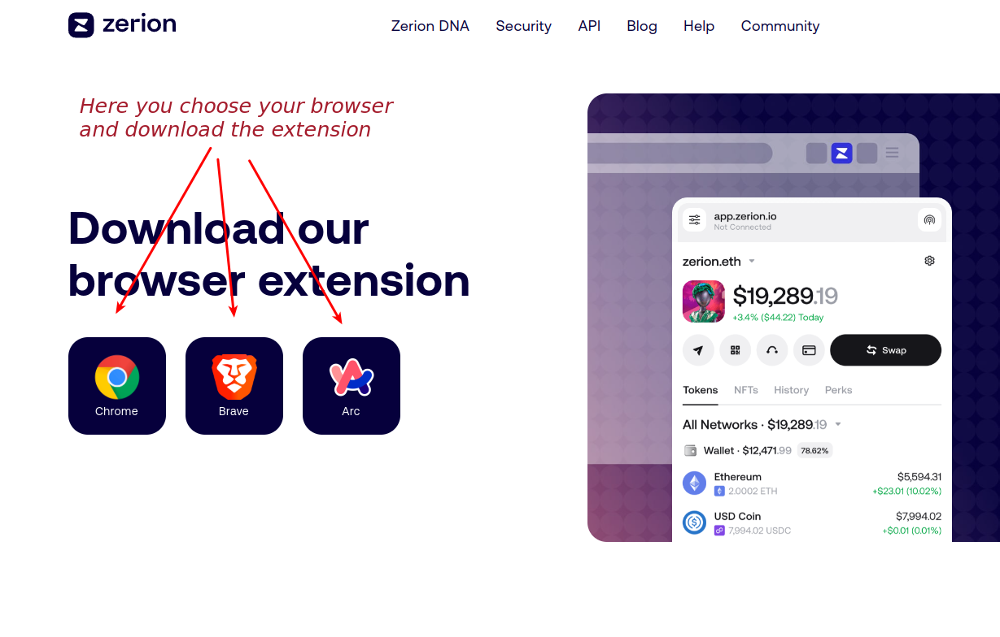
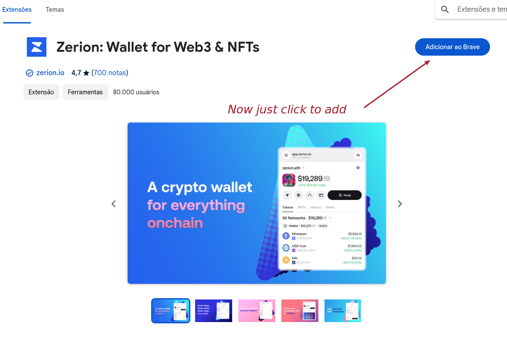
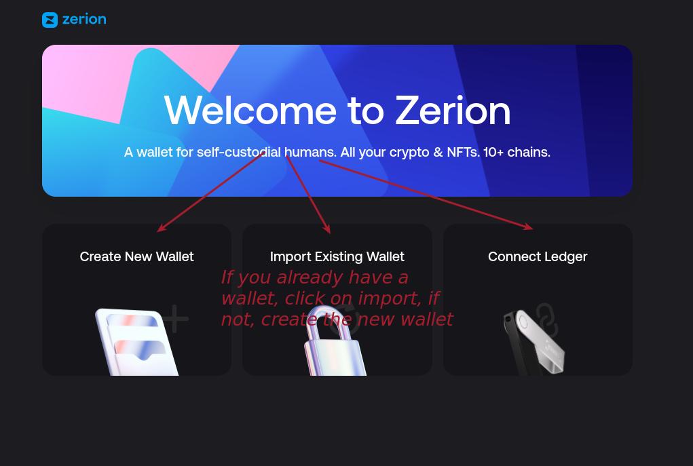
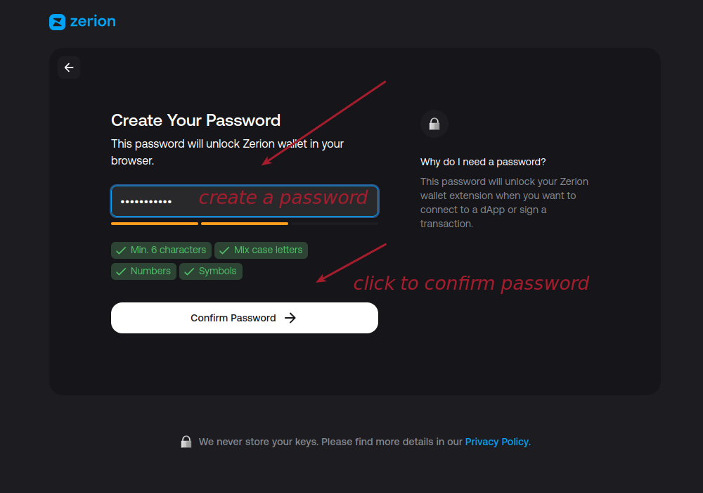
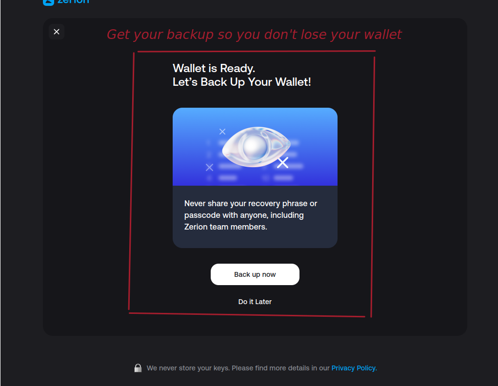
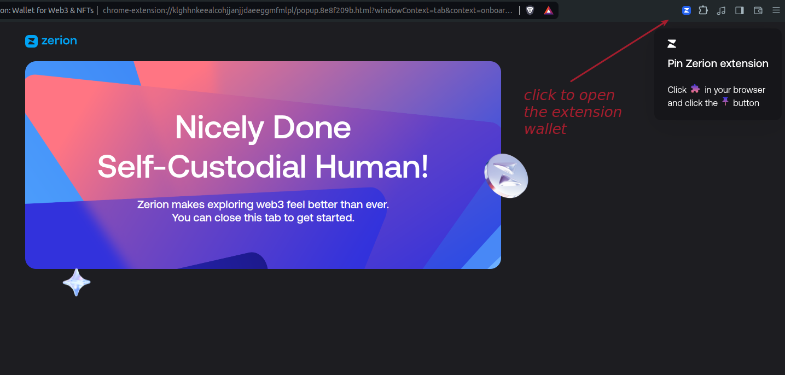
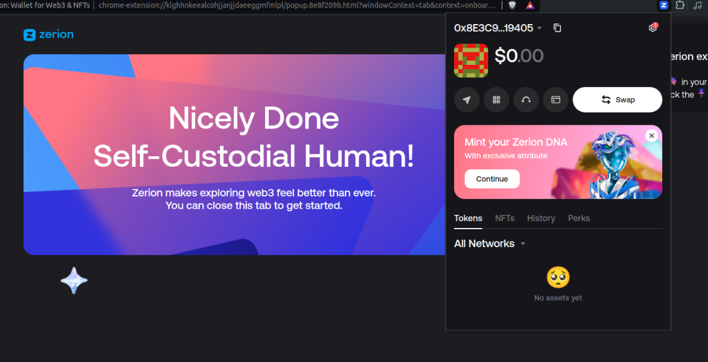

 ## Guia de Instalação e Uso da Extensão Zerion
1. Zerion é uma plataforma que permite gerenciar ativos em várias blockchains.

2. Como Baixar a Extensão Zerion https://zerion.io/download

3. Adicione a extensão em seu navegador

4. isso irá abrir para você, dê as boas vindas

5. Escolha sua senha de acesso, a senha será responsável para dar acesso a sua carteira no navegador

6. Salve suas palavras chave em um lugar seguro e sem acesso tecnologico (como o papel)

7.  Abra sua extensão no canto superior direito

8. Sua carteira foi configurada, parabéns 

