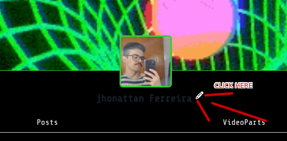

### Como ter sorte

1. Acesse <a href="https://skatehive.app" class="button-link" target="_blank">**skatehive.app**</a> e conecte suas carteiras Hive e Ethereum.
2. **Visite sua página de perfil**.
3. **Clique no botão "Editar Perfil"** (ícone de lápis).
   
4. **Clique no botão azul "Adicionar Carteira Ethereum"**.
   
5. **Comece a usar o Skatehive**: poste, curta e comente no Feed.
6. **Importante**: Você precisa ter uma **carteira Ethereum registrada** para receber os airdrops HIVE por enquanto.

### Como criar um airdrop

7. Na página inicial, **clique no botão "Criar Airdrop"**.
   
8. **Aguarde o nosso Pepe God** fazer os cálculos. Neste momento, ele está mirando em todos que configuraram sua carteira e estão postando ativamente. **Em breve**, vamos permitir que os usuários personalizem os parâmetros do airdrop e filtrem usuários indesejados.
   
9. **Escolha o valor**, e prepare-se para os **confetes** aparecerem na sua tela! 🎉
   

---

### Primeira vez com Airdrops EVM?

- Se esta é a **primeira vez que você interage com um airdrop EVM**, sua carteira pedirá permissão para interagir com o contrato do airdrop.
- Após conceder a permissão, a **segunda transação** deve ser disparada automaticamente.
- Se isso não acontecer, simplesmente **clique no botão novamente**. (*Estamos melhorando esse processo.*)
