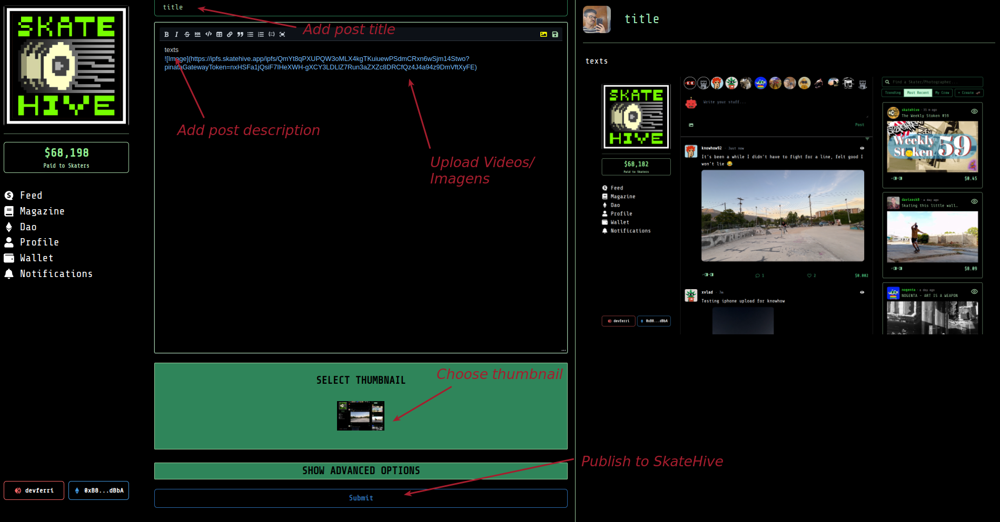

# Publicar em Skatehive.app

1. Clique no ícone de skate (e escrito upload), no canto superior direito da tela
2. Adicione o título da postagem
3. Adicione a descrição da postagem
4. Envie suas fotos ou cole links de vídeos*
5. Veja uma pré-visualização da sua postagem e certifique-se de que parece legal
6. Clique em "Publish"

7. Parabéns, você acabou de publicar na Skatehive.app
