# Como fazer um fork da Skatehive 🛹

Faremos este tutorial para qualquer pessoa que queira criar sua própria comunidade com a tecnologia da skatehive, como https://skatehive.app

Você precisará instalar algumas coisas em sua máquina para preparar seu computador para o desenvolvimento do fork.

O código ainda está um pouco confuso, mas convido você a fazer parte do nosso aprendizado. Este documento será sempre atualizado em: https://docs.skatehive.app

## Index

- Instale o Git e configure a conta do Github
- Configure suas keys SSH do Github
- Fork o repositorio
- Clone/Download o repositorio
- Faça o Dowload e instale o Node.js
- Instale o pnpm
- Instale as dependencias com o comando `pnpm`
- Mude as variaveis .env
- Execute com o comando `pnpm dev`
- Fiz algumas modificações apenas por diversão
- Envie suas alterações para o github
-  Coloque seu fork online, faça deploy com o vercel


## Instale o Git e configure a conta do Github

Baixe e instale o Git em sua máquina local. Isso permitirá que você execute comandos git em seu terminal, como `git clone` e outros comandos

[Download Git](https://git-scm.com/downloads)
[Learn More about git and its instalation](https://www.youtube.com/results?search_query=what+is+git+how+to+install)

## CCrie sua conta no GitHub

Basta se inscrever

## Configure suas chaves (Keys) SSH do Github

Para tornar o processo mais tranquilo, vamos configurar uma conexão SSH gerando chaves SSH.

1. Abra seu terminal

2. Digite o seguinte comando
> use o mesmo e-mail que você usou para criar a conta no github

```
ssh-keygen -t ed25519 -C "your_email@example.com"
``` 
> Isso cria uma nova chave SSH, usando o e-mail fornecido como rótulo.

3. Inicie o agente ssh em segundo plano
```
eval "$(ssh-agent -s)"
```

4. Copie o conteúdo do arquivo id_ed25519.pub para sua área de transferência
- Para usuarios do Mac: 
`pbcopy < ~/.ssh/id_ed25519.pub`

- Para usuarios do Windows: 
`clip < ~/.ssh/id_ed25519.pub`


 Dê um título e cole o conteúdo em Key
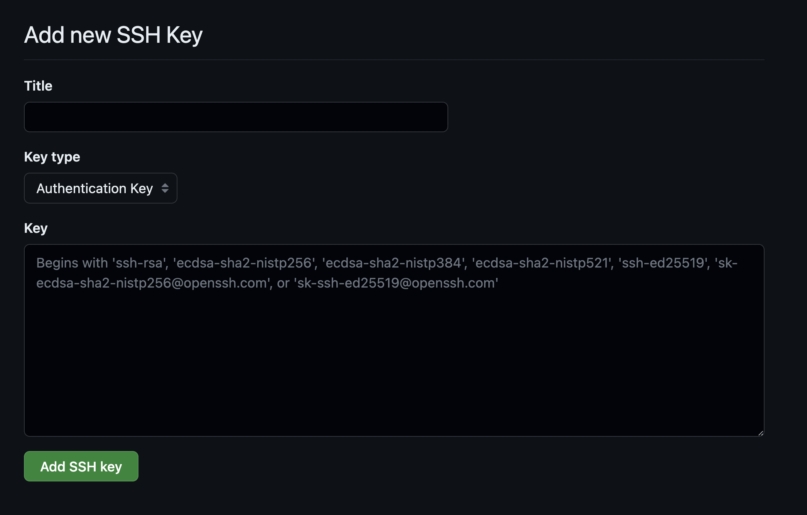


> [Full SSH Tutorial](https://docs.github.com/en/authentication/connecting-to-github-with-ssh)

## Fork o repositorio

 **[Click Fork Button](https://github.com/sktbrd/skateapp)** 

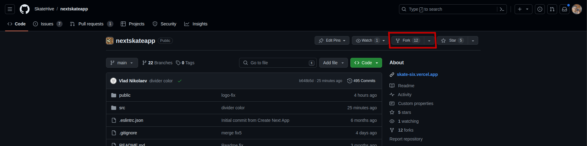

Isso criará sua própria versão do repositório em sua conta:

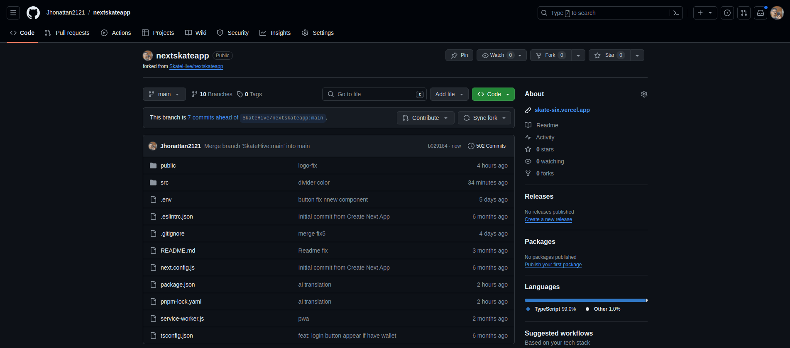

Pronto, agora você vai clonar o repositório de arquivos na sua máquina, que é basicamente baixar o app:

```
git clone git@github.com:<your-username>/<your-fork>.git
```

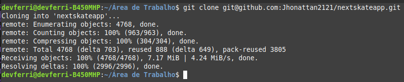


Agora navegue até o repositório clonado por:

```
cd <your-fork>
```

Nesse caso, 

```
cd skateapp
``` 

Para a próxima etapa precisaremos instalar mais alguns programas em seu computador para completar seu ambiente e finalmente instalar e executar o aplicativo.

## [Download and install Node.Js](https://nodejs.org/en)

> Nada sofisticado aqui, basta instalar e deixar o `add to path` marcado.

## [Install Yarn Here](https://classic.yarnpkg.com/lang/en/docs/install/#mac-stable)

> [More ways to install Yarn](https://www.youtube.com/results?search_query=install+yarn)


Se você possui Nodejs, npm, yarn e weed/coffee agora você pode instalar e executá-lo em seu computado.

## Voltando ao terminal... 

Na pasta do repositório
```
yarn
```
> Nota: Este comando instalará automaticamente todos os pacotes JavaScript e dependências necessários para o seu projeto, conforme especificado no arquivo package.json. O Yarn irá baixar e configurar tudo o que for necessário para executar a Skatehive.
Esta etapa garante que você tenha todas as bibliotecas e ferramentas necessárias em seu computador para construir e executar o aplicativo.

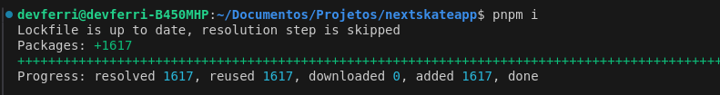
Espere um pouco, tome um "café"...

Você deverá ver isso quando acabar:
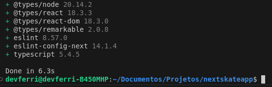

> Se você receber um erro em alguma etapa, você pode jogá-lo no chat-gpt ou perguntar-nos em [skatehive discord](https://discord.gg/skatehive) e ver qual deles ajuda você mais rápido


## Renomeie .env.example para .env 

Renomeie .env.example e escolha a comunidade Hive da qual deseja obter/carregar conteúdo. Por exemplo, se você usar o hive-173115 você obterá o skatehive, se você usar o hive-141964 no campo comunitário você obterá o surfhive

## .env.example
NEXT_PUBLIC_WEBSITE_URL=http://localhost:3000/
NEXT_PUBLIC_HIVE_COMMUNITY_TAG=xxxxxxxxxxx
NEXT_PUBLIC_PINATA_API_KEY=xxxxxxxxxxxxxxxxxxxxxxxxxxxxxxxx
NEXT_PUBLIC_PINATA_SECRET=xxxxxxxxxxxxxxxxxxxxxxxxxxxxxxxxxxxxxxxxxxxxxxxxxxxxx
NEXT_PUBLIC_PINATA_GATEWAY_TOKEN=xxxxxxxxxxxxxxxxxxxxxxxxxxxxxxxxxxxxxxxxxxxxxx
NEXT_PUBLIC_CRYPTO_SECRET=xxxxxxxxxxxxxxxxxxxxxxxxxxxxxxxxxxxxxxxxxxxxxxxxxxxxx
NEXT_PUBLIC_OPENAI_API_KEY=xxxxxxxxxxxxxxxxxxxxxxxxxxxxxxxxxxxxxxxxxxxxxxxxxxxx
NEXT_PUBLIC_ETHERSCAN_API=xxxxxxxxxxxxxxxxxxxxxxxxxxxxxxxxxxxxxxxxxxxxxxxxxxxxx


Agora execute o aplicativo que você acabou de instalar:
```
pnpm dev
```
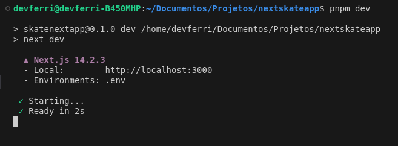


Agora abra https://localhost:5173 e você verá o mesmo aplicativo que https://skatehive.app


Isso significa que você está executando o aplicativo usando seu próprio computador como servidor através da porta 5173

Agora você pode tentar editar seu código em um editor de código, eu recomendo [VSCode](https://code.visualstudio.com/), mas meu Mestre Jedi recomenda [JetBrains](https://www.jetbrains.com/ )

Eu costumo usar o comando `code.` na pasta do terminal para abrir facilmente a pasta em que estamos trabalhando no VScode

Faça uma mudança boba, como mudar o rodapé.

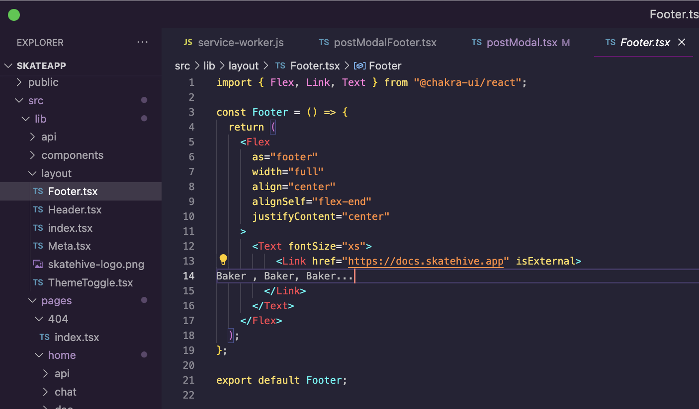


Este projeto é construído com TypeScript e incorpora Chakra UI para o frontend. Para tarefas relacionadas ao Hive, contamos com o [Keychain SDK](https://play.hive-keychain.com/) e as bibliotecas dive. Além disso, para facilitar as interações com Ethereum, Bitcoin e vários outros blockchains, aproveitamos os recursos do [Pioneer-React](https://github.com/BitHighlander/pioneer-react#readme).


**Stage Changes:**
```
git add .
````
> Prepare suas alterações para um commit.

**Commit Changes:**

```
git commit -m "Changed header color".
```
> Commit com uma mensagem

**Push to GitHub:**
```
git push origin main
```
> Envie suas mudanças

Agora você pode acessar sua conta do github e verificar se ela foi atualizada

## Colocando seu website online

##  Va para  vercel.com 

1. Faça uma conta com sua conta do github 
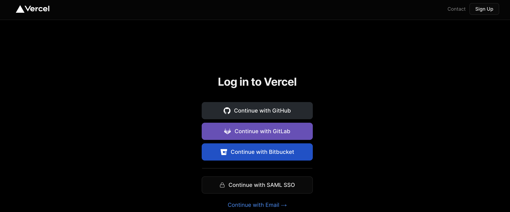

2.Instale a extensão Github 
3. Selecione o repositório
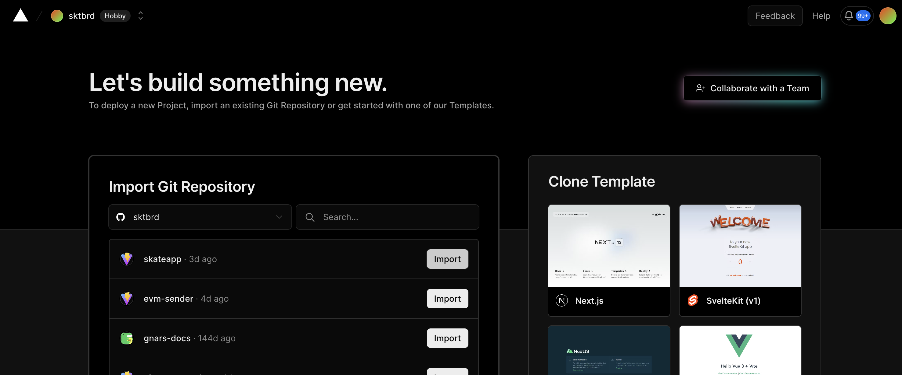

4. Clique em Deploy

Você deverá ver algo assim:

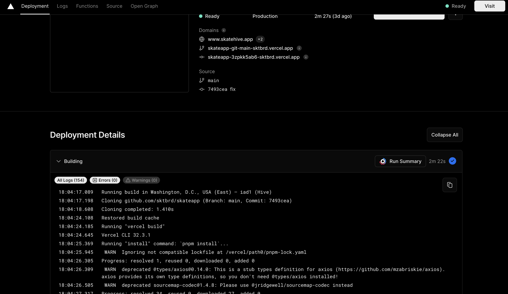
 

Você pode navegar agora para:

https://your-repo.vercel.app 

 Veja sua própria comunidade Hive.

Parabéns! Que legal, você colocou um site  online! Vá mostrar para sua mãe, diga que estou com saudades dela.
--- 


